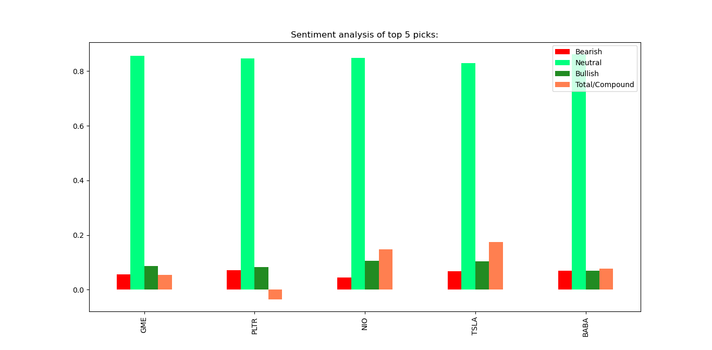

# r/Wallstreetbets sentiment analysis
This program finds the most mentioned ticker on r/wallstreetbets and uses Vader SentimentIntensityAnalyzer to calculate the sentiment analysis.

Check out the improved version of sentiment analysis: https://github.com/asad70/reddit-sentiment-analysis

# About r/wallstreetbets
WSB is a subreddit community on Reddit where participants discuss stock and options trading. It's aggressive trading strategies revolve around highly speculative, leveraged options trading. Some of the members tend to use borrowed capital, like student loans or margin.

## Sample Output
It took 350.54 seconds to analyze 7085 comments in 16 posts.

Posts analyzed:\
Weekend Discussion Thread for the Weekend of January 01, 2021\
How I'm making money while I lose money\
Nio has just been orbiting earth to build up momentum to sling shot to the moon🚀🚀🚀🚀\
.\
[Includes the title of all the posts analyzed (16 posts in this example)]\
.\
Bloomberg Getting In On Our Lingo

10 most mentioned picks:\
GME: 134\
PLTR: 119\
NIO: 101\
TSLA: 96\
BABA: 41\
AAPL: 28\
SQ: 23\
RIOT: 19\
U: 14\
PSTH: 14

Sentiment analysis of top 5 picks:\
&nbsp; &nbsp; &nbsp; &nbsp; Bearish &nbsp; Neutral &nbsp; Bullish &nbsp; Total/Compound\
GME    &nbsp; 0.057  &nbsp;  0.856  &nbsp;&nbsp;   0.087      &nbsp; &nbsp; &nbsp;     0.055\
PLTR  &nbsp;  0.071  &nbsp;  0.847  &nbsp;&nbsp;   0.082    &nbsp;  &nbsp;  &nbsp;   -0.035\
NIO   &nbsp;  0.044  &nbsp;  0.849  &nbsp;&nbsp;   0.106     &nbsp; &nbsp;  &nbsp;    0.148\
TSLA  &nbsp;  0.068  &nbsp;  0.829  &nbsp;&nbsp;   0.103     &nbsp;  &nbsp; &nbsp;   0.175\
BABA  &nbsp;  0.069  &nbsp;  0.862  &nbsp;&nbsp;   0.070     &nbsp;  &nbsp; &nbsp;   0.077\

## Data:
Includes US stocks with market cap > 100 Million, and price above $3. As wsb doesn't allow penny stocks discussions.\
Source:  https://www.nasdaq.com/market-activity/stocks/screener?exchange=nasdaq&letter=0&render=download 

Implementation:
I am using sets to compare that if the ticker is valid, sets time complexity for
"x in s" is O(1) compare to list: O(n).

Limitations:
It depends mainly on the defined parameters for current implementation:
It completely ignores the heavily downvoted comments, and there can be a time when
the most mentioned ticker is heavily downvoted, but you can change that in upvotes variable.

## License
[MIT](https://choosealicense.com/licenses/mit/)
